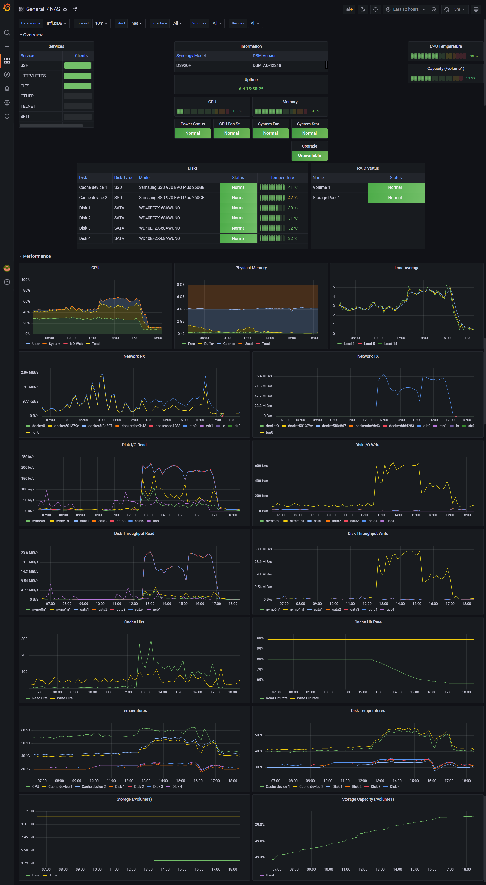

Synology NAS monitoring
=======================

Configuration files and tutorial on how to monitor your Synology NAS using SNMP, Telegraf, InfluxDB and Grafana.



### Motivation

There are [already few](https://github.com/alhazmy13/Synology-NAS-monitoring)
[SNMP/Grafana monitoring solutions](https://github.com/kernelkaribou/synology-monitoring) available.
However, they are usually:
* outdated
* simply wrong (e.g. monitoring _Docker's_ CPU & disk I/O instead of Synology NAS)
* full of hard coded values
* based on older InfluxDB 1 & InfluxQL

This Synology NAS monitoring uses InfluxDB 2 with Flux query language and the dashboard is configurable with virtually
zero hard coded values.

### Configuration

Enable SNMP service on Synology NAS.
In DSM:
* `Control Panel` -> `Terminal & SMNP` -> `SNMP` tab
* Check `Enable SNMP service`
* Check `SNMPv1, SNMPv2c service`
* Community: `public`
* Click `[Apply]`

> Warning: this setting is not secure, especially if your NAS is exposed to the Internet.
> For more security, choose different `Community` (e.g. random string) or enable and configure `SNMPv3 service`.
> Note that if you change `Community` or enable `SNMPv3 service`, you have to make appropriate changes to the Telegraf
> configuration. Please, consult the [documentation](https://github.com/influxdata/telegraf/blob/master/plugins/inputs/snmp/README.md).

* Install Docker
* Download [`telegraf`](https://hub.docker.com/_/telegraf),
           [`influxdb`](https://hub.docker.com/_/influxdb) and
           [`grafana/grafana`](https://hub.docker.com/r/grafana/grafana)
           images from the Docker registry
    * Download `latest` tag for all images
* Copy `telegraf` and `influxdb` folders from this repository into the `docker` shared folder on the NAS

#### Create `influxdb` container

In `Advanced Settings`:
* Advanced Settings
    * Check `Enable auto-restart`
* Volume
    * Folder `docker/influxdb/var/lib/influxdb2` -> `/var/lib/influxdb2` (as read-write)
* Network
    * Check `Use the same network as Docker Host`
* Envorinment
    * `DOCKER_INFLUXDB_INIT_MODE` -> `setup`
    * `DOCKER_INFLUXDB_INIT_USERNAME` -> `my-user`
    * `DOCKER_INFLUXDB_INIT_PASSWORD` -> `my-password`
    * `DOCKER_INFLUXDB_INIT_ORG` -> `NAS`
    * `DOCKER_INFLUXDB_INIT_BUCKET` -> `telegraf`

InfluxDB should be now available at `http://your-nas:8086/`.

#### Create `telegraf` container

In `Advanced Settings`:
* Advanced Settings
    * Check `Enable auto-restart`
* Volume
    * File `docker/telegraf/etc/telegraf/telegraf.conf` -> `/etc/telegraf/telegraf.conf` (as read-only)
    * Folder `docker/telegraf/mibs` -> `/mibs` (as read-only)
* Network
    * Check `Use the same network as Docker Host`

**Before running the container:**
* Edit `docker/telegraf/etc/telegraf/telegraf.conf` appropriately
    * In `[[outputs.influxdb_v2]]`, you must change `urls` & `token` (eventually `organisation` & `bucket` if you wish
      to change them)
        * InfluxDB token can be found on `http://your-nas:8086/`, in the `Data` menu (on the left), on the `API Tokens`
        tab, after clicking on `my-user's Token`
    * In each instance of `[[inputs.snmp]]`, you must change `agents` (you can choose IP or hostname)
        * You can specify multiple agents if you wish to monitor multiple NAS devices

#### Create `grafana` container

In `Advanced Settings`:
* Advanced Settings
    * Check `Enable auto-restart`
* Network
    * Check `Use the same network as Docker Host`

Grafana should be now available at `http://your-nas:3000/`.
Default credentials are `admin`:`admin`. After login, it will ask you for a new password.

**After logging into Grafana web interface:**
* Go to `Configuration` -> `Data sources`
    * `Add data source` -> `InfluxDB`
    * `Query Language` -> `Flux`
    * `HTTP`
        * `URL` -> `http://your-nas:8086`
    * `Auth`
        * Disable `Basic auth`
        * (Everything should be disabled in this group)
    * `InfluxDB Details`
        * `Organization` -> `NAS` (or whatever specified previously in `DOCKER_INFLUXDB_INIT_ORG`)
        * `Token` -> Your InfluxDB token (as described above)
        * `Default Bucket` -> `telegraf`
    * Click `[Save & test]`
* Go to `Create [+]` -> `Import` (`http://your-nas:3000/dashboard/import`)
    * Click `[Upload JSON file]`
    * Select `grafana/dashboard.json`
    * Click `[Import]`

If not selected by default, choose appropriate `Data source` at the top.

### License

Content of this repository - except the `telegraf/mibs` folder - is open-source under the MIT license. See the LICENSE.txt file in this repository.

`telegraf/mibs` folder contains following files:
* Every file from the [Synology_MIB_File.zip](https://global.download.synology.com/download/Document/Software/DeveloperGuide/Firmware/DSM/All/enu/Synology_MIB_File.zip)
* `HOST-RESOURCES-MIB.txt`, `IF-MIB.txt`, `SNMPv2-MIB.txt`, `SNMPv2-SMI.txt` and
  `UCD-SNMP-MIB.txt` from the [net-snmp github repository](https://github.com/net-snmp/net-snmp)

If you find this project interesting, you can buy me a coffee

```
  BTC 3GwZMNGvLCZMi7mjL8K6iyj6qGbhkVMNMF
  LTC MQn5YC7bZd4KSsaj8snSg4TetmdKDkeCYk
```